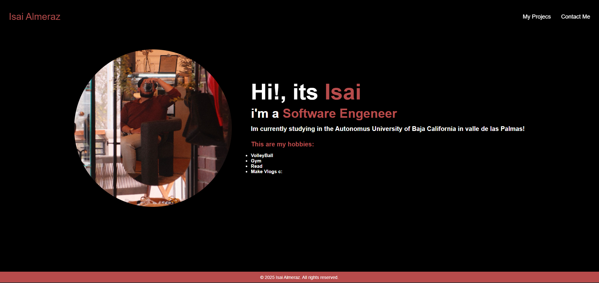
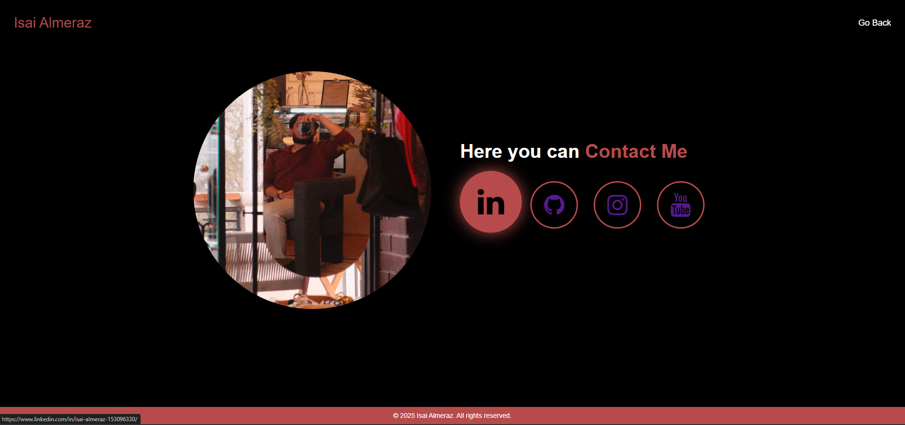

# Practice #1 - Personal Portfolio

This is my first web development project, a personal portfolio I created as part of my first assignment. Here, I share a bit about myself, my hobbies, and how to contact me. Although it's a simple practice project, I added some visual effects to make it more interesting.

## What is this?

It's a webpage with two main sections:

1. **Home (`index.html`)**: Here, you can find a brief introduction about me, what I study, and my hobbies (such as playing volleyball, going to the gym, reading, and making vlogs). There's also a profile picture and a link to my GitHub projects.

2. **Contact (`Contact.html`)**: This section includes links to my social media profiles (LinkedIn, GitHub, Instagram, and YouTube).

## Some things I did

- **Transition effects**: The links in the navigation bar change color and have an animated underline when you hover over them. Additionally, the social media icons enlarge and change color when you interact with them.
- **Circular profile picture**: The profile photo has rounded edges to give it a more modern style.

## Page Screenshots

  

## How to view the project?

You can view the project directly in my GitHub repository:  
[View on GitHub](https://github.com/Its-isaku/Semestre_5/tree/main/desarrollo_web/Parcial_1/Prac1)

Simply open the `index.html` and `Contact.html` files to see how it turned out.