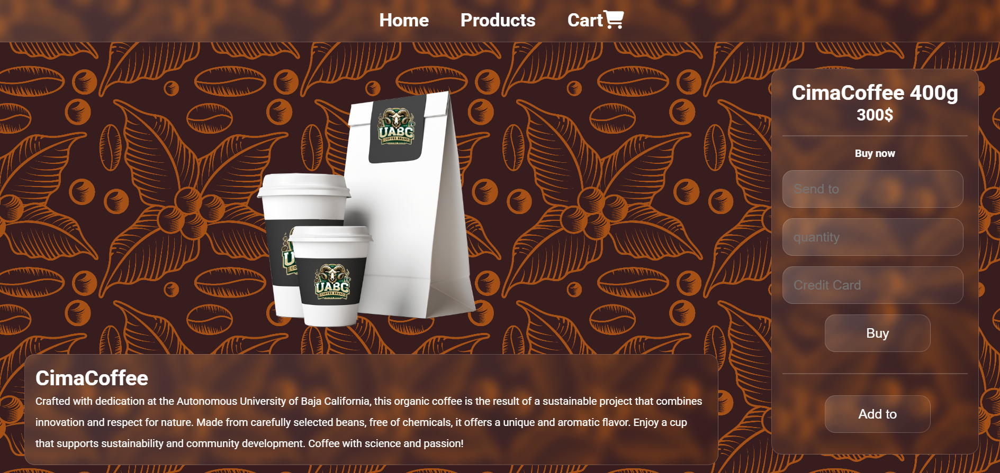

# Practice #2 - Responsive Coffee Product Page

This is my second web development project, where I created a responsive product page. The project was part of an assignment to practice using **Flexbox** for layout design and to ensure the page is fully responsive. The page showcases coffee beans produced by students at **UABC**.

## What is this?

It's a responsive webpage designed to showcase and sell a unique coffee product. The layout is divided into two main columns:

1. **Left Column**: Features an image of the coffee product along with a detailed description of its origin.
2. **Right Column**: Includes options to purchase the product, such as selecting the quantity, adding it to the cart A shopping cart icon from **FontAwesome** is used for a clean and modern design.

## Key Features

- **Flexbox Layout**: The two-column layout is created using **Flexbox**, making it easy to align and distribute content.
- **Glassmorphism Style**: The navbar and product description boxes use a translucent, glass-like effect to create a modern and elegant look.
- **Interactive Elements**: 
  - The navbar links have smooth hover transitions, including color changes.
- **FontAwesome Integration**: A shopping cart icon from FontAwesome is used to represent the cart functionality.

## Page Screenshots

  

## How to View the Project?

You can view the project directly in my GitHub repository:  
[View on GitHub](https://github.com/Its-isaku/Semestre_5/tree/main/desarrollo_web/Parcial_1/Prac2-Two-Column)

Simply open the `index.html` file to see how it turned out.
