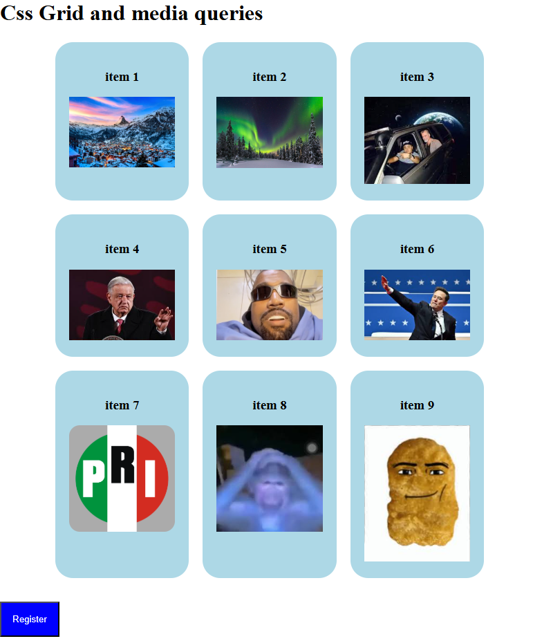
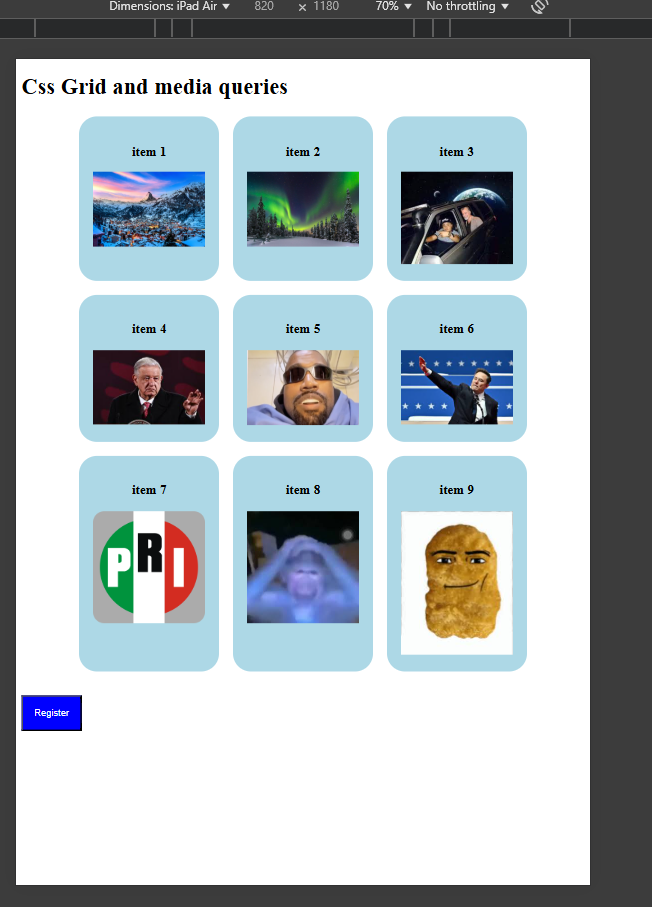
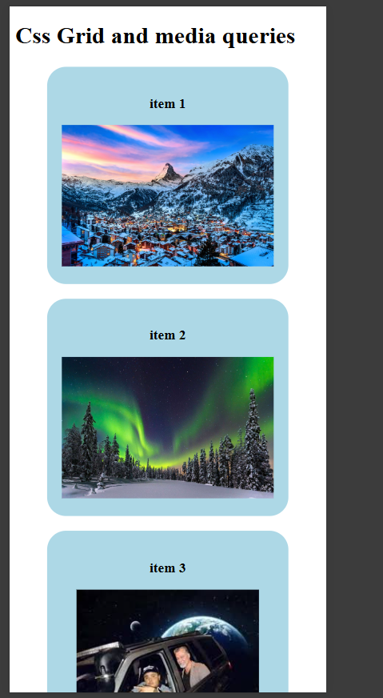

# Practice #3 - Responsive Image Gallery

This is my third web development project, where I created a responsive 3x3 image gallery. The project was part of an assignment to practice using **CSS Grid** for layout design and **media queries** to ensure the gallery adapts to different screen sizes. The gallery showcases a collection of images in a clean and organized grid.

## What is this?

It's a responsive webpage featuring a 3x3 image gallery. The layout is designed using **CSS Grid**, and the gallery adjusts seamlessly to different screen sizes (desktop, tablet, and mobile) using **media queries**. Each image in the gallery is clickable and can be expanded for a better view.

## Key Features

- **CSS Grid Layout**: The gallery is built using a **3x3 grid**, making it easy to align and organize images.
- **Responsive Design**: The gallery is fully responsive, adapting to different screen sizes using **media queries**.
  - On smaller screens, the grid adjusts to a **2x2** or **1x1** layout for better readability.
- **Interactive Elements**:
  - Images have hover effects to enhance user interaction.
  - Clicking on an image opens a larger view or a modal (if implemented).

## Page Screenshots

  
  
  

## How to View the Project?

You can view the project directly in my GitHub repository:  
[View on GitHub](https://github.com/Its-isaku/Semestre_5/tree/main/desarrollo_web/Parcial_1/Prac3-Image-Gallery)
