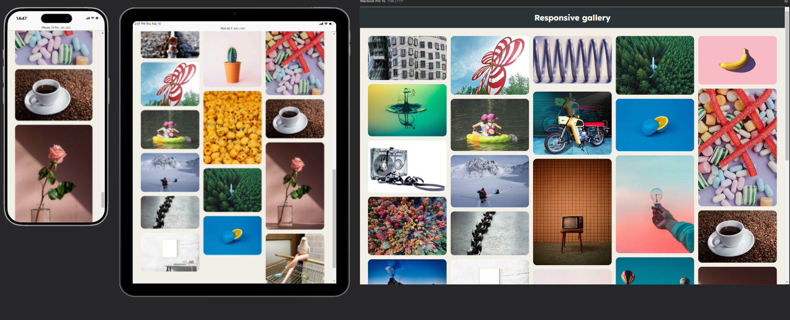
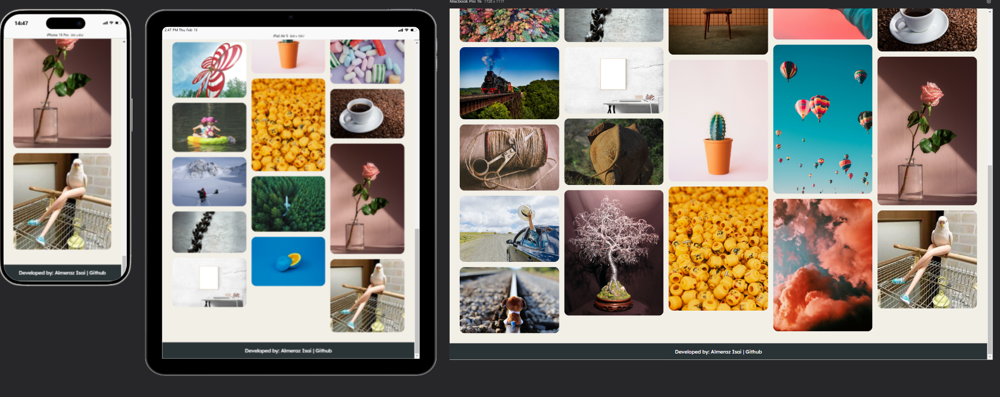

# Practice #3 - Responsive Gallery

This is my third web development project, where I created a **responsive image gallery** using **CSS Grid** and **media queries**. The project was part of an assignment to practice creating responsive layouts that adapt to different screen sizes. The gallery showcases a collection of images in a Pinterest-like layout.

## What is this?

It's a responsive webpage designed to display a gallery of images in a dynamic and visually appealing way. The layout adjusts seamlessly across different devices, ensuring a great user experience. Key features include:

1. **CSS Grid Layout**: The gallery uses CSS Grid to create a flexible and responsive layout.
2. **Masonry Effect**: Images of varying heights are arranged in a grid without leaving large gaps, similar to Pinterest.
3. **Media Queries**: The layout adapts to different screen sizes, ensuring responsiveness on desktops, tablets, and mobile devices.
4. **Interactive Elements**: Images scale slightly on hover, adding a subtle interactive effect.

## Key Features

- **CSS Grid**: The gallery is built using CSS Grid, allowing for a flexible and responsive layout.
- **Masonry Layout**: Images of different heights are arranged dynamically, creating a visually appealing grid.
- **Responsive Design**: Media queries ensure the gallery looks great on all devices, from desktops to mobile phones.
- **Hover Effects**: Images scale slightly when hovered over, adding interactivity.
- **Responsive Testing**: I used the **Responsive Viewer** Chrome extension to test and fine-tune the layout across different screen sizes.

## Page Screenshots

  
  

