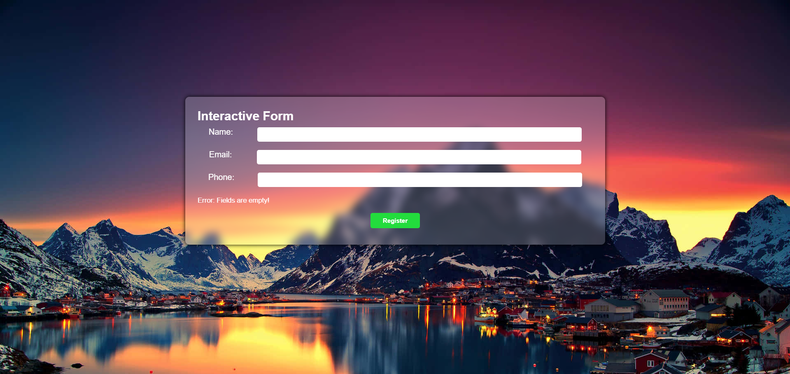
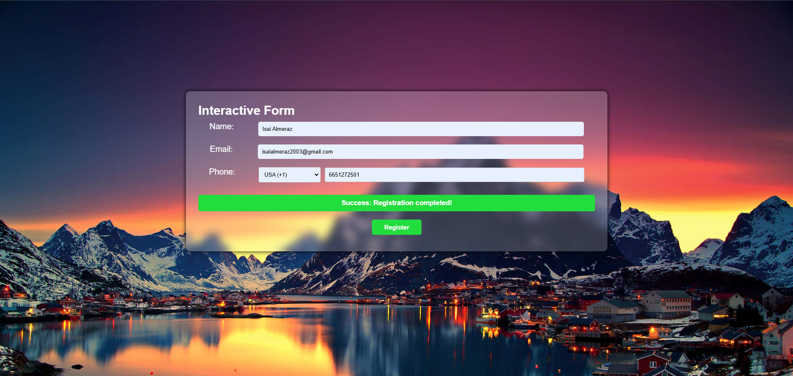
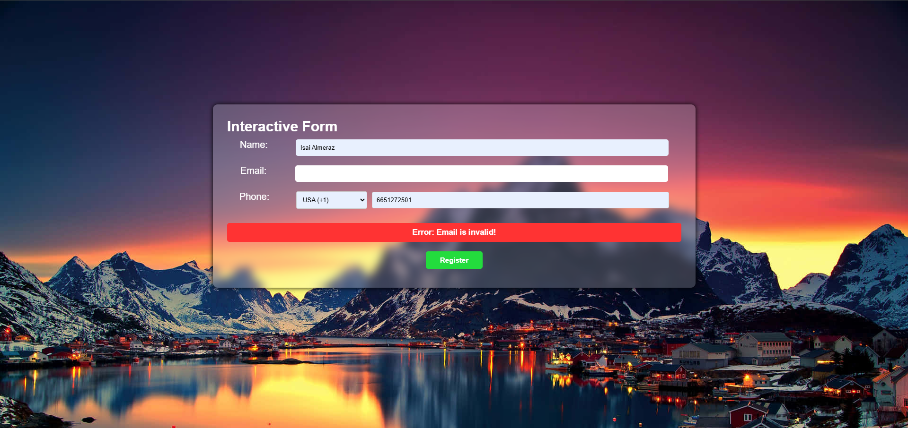

# Practice #4 - Form Validation with JavaScript

This is my fourth web development project, where I created a **responsive form** and implemented **client-side validation using JavaScript**. The project was part of an assignment to practice handling form inputs and validating user data. The form ensures that all fields are filled out correctly before submission.

## What is this?

It's a responsive webpage designed to collect user information through a form. The form includes validation to ensure that all fields are filled out correctly and that the data meets specific requirements. Key features include:

1. **Form Validation**: JavaScript is used to validate user inputs, ensuring that no fields are left empty and that the data is in the correct format.
2. **Responsive Design**: The form layout adjusts seamlessly across different devices, ensuring a great user experience on desktops, tablets, and mobile devices.
3. **Interactive Feedback**: Users receive immediate feedback if they leave a field empty or enter incorrect data.
4. **Simple and Clean Design**: The form is designed to be user-friendly and easy to navigate.

## Key Features

- **Form Validation**: JavaScript ensures that all fields are filled out correctly before the form can be submitted.
- **Responsive Design**: The form layout is responsive, adapting to different screen sizes for optimal viewing on all devices.
- **Interactive Feedback**: Users receive real-time feedback on their inputs, helping them correct errors before submitting the form.
- **Clean and Simple Design**: The form is designed to be intuitive and easy to use, with a focus on user experience.
- **Responsive Testing**: I used the **Responsive Viewer** Chrome extension to test and fine-tune the layout across different screen sizes.

## Page Screenshots

  
  
  

---