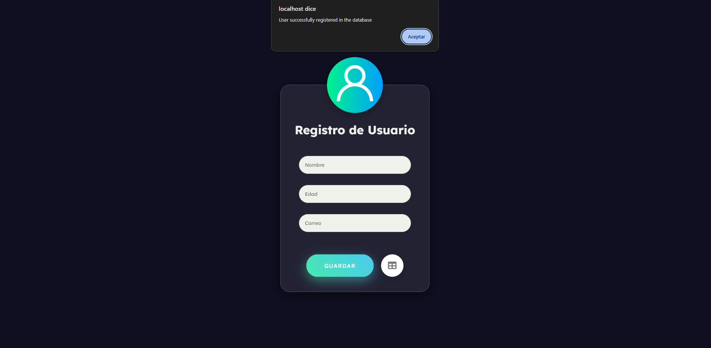
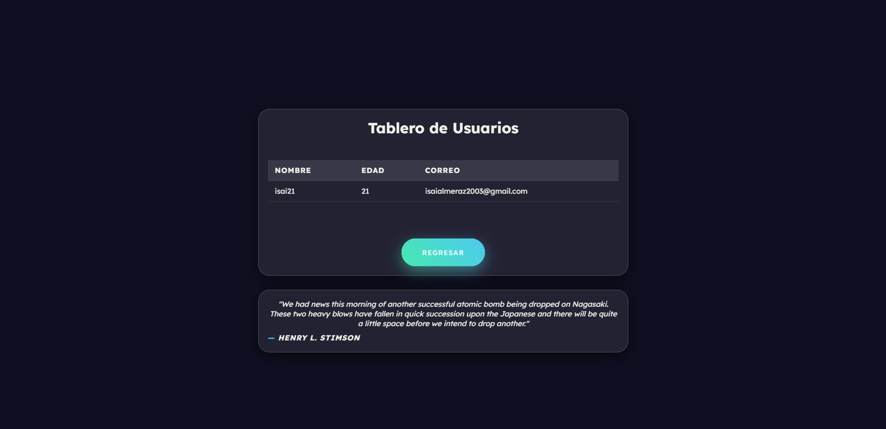

# **Final Practice - Student Registration Form**  

This is my final web development project, where I applied everything learned throughout the course. In this project, I implemented **PHP** to handle form submissions, created and connected a **MySQL database** to store student records, and displayed the registered data dynamically in a table. Additionally, I integrated an **API** of my choice (a quotes API) and enhanced the user experience with **JavaScript animations**.  

## **What is this?**  

It's a responsive **Student Registration Form** that allows users to submit their information and stores it in a database. The application supports:  

1. **Student Registration**: Users can enter their details (e.g., name, email, student ID) and submit the form.  
2. **Data Storage**: The submitted information is stored in a **MySQL database** using **PHP**.  
3. **Dynamic Data Display**: A table dynamically displays all registered students from the database.  
4. **API Integration**: An external **quotes API** fetches and displays motivational quotes.  
5. **Responsive Design**: The form and table adapt to different screen sizes for a seamless experience.  
6. **JavaScript Animations**: Smooth UI transitions enhance usability and engagement.  

## **Key Features**  

- **Secure Data Handling**: Form validation and database connection to ensure proper data management.  
- **PHP & MySQL Integration**: Backend functionality for storing and retrieving student records.  
- **Dynamic Table**: The registered students are displayed in a real-time updated table.  
- **API Usage**: Fetches quotes to display on the page for a more interactive experience.  
- **User-Friendly Design**: Clean, intuitive interface with smooth animations.  

## **Screenshots**  

  
  
  
  

