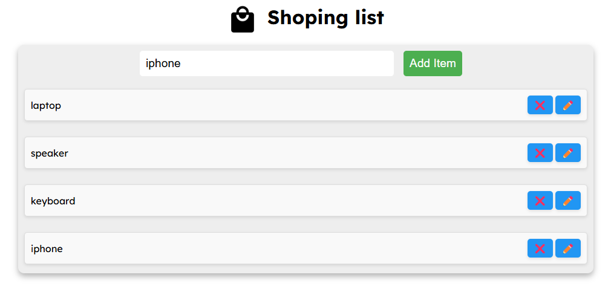
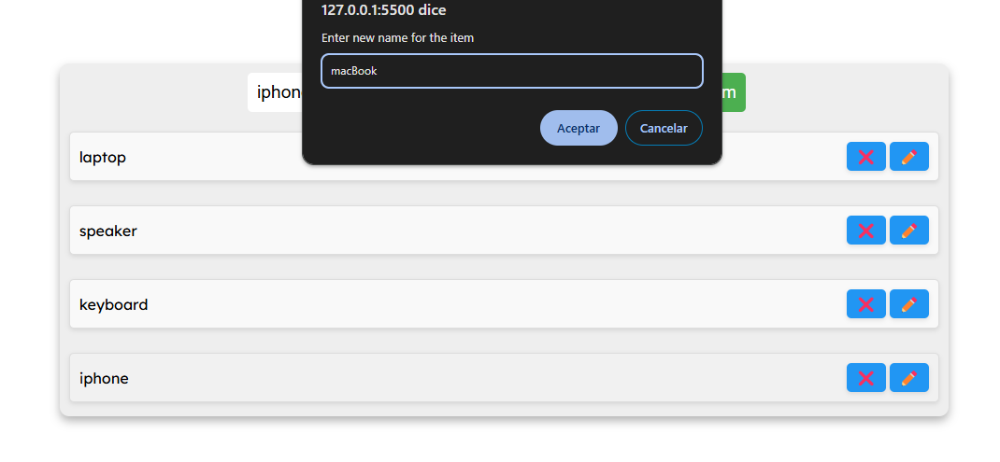
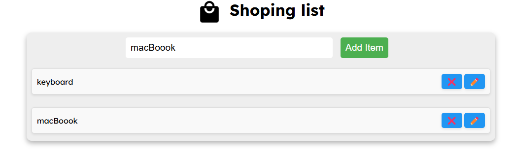

# Practice #5 - Shopping List Manager

This is my fifth web development project, where I created a **Shopping List Manager** that allows users to add, edit, and delete tasks dynamically. The project was part of an assignment to practice using the **DOM** to manipulate web page content and implement basic styles for a clean and functional design. Users can interact with the list through prompts, making it simple and intuitive to manage their shopping items.

## What is this?

It's a responsive webpage designed to help users manage their shopping list. The application allows users to:

1. **Add Tasks**: Users can add new items to the shopping list using an input field.
2. **Edit Tasks**: Users can edit existing items using a **prompt** for a seamless editing experience.
3. **Delete Tasks**: Users can remove items from the list with a single click.
4. **Dynamic Updates**: The list updates in real-time using the **DOM**, ensuring a smooth user experience.
5. **Clean Design**: The interface is simple and intuitive, with basic styles applied to make the list easy to read and interact with.

## Key Features

- **Dynamic Task Management**: Users can add, edit, and delete tasks using the **DOM** for real-time updates.
- **Interactive Prompts**: Editing tasks is done through a **prompt**, making it easy for users to modify their list.
- **Clean and Simple Design**: The shopping list is styled with a minimalist approach, focusing on usability and clarity.
- **Responsive Layout**: The page is designed to work seamlessly across different devices, ensuring a consistent experience on desktops, tablets, and mobile devices.
- **User-Friendly Interface**: The design prioritizes ease of use, with clear buttons and intuitive interactions.

## Page Screenshots

  
  
  

---

## How to View the Project?

You can view the project directly in my GitHub repository:  
[View on GitHub](https://github.com/Its-isaku/Semestre_5/tree/main/desarrollo_web/Parcial_1/Prac5-Shopping-List)

Simply open the `index.html` file to see how it turned out.