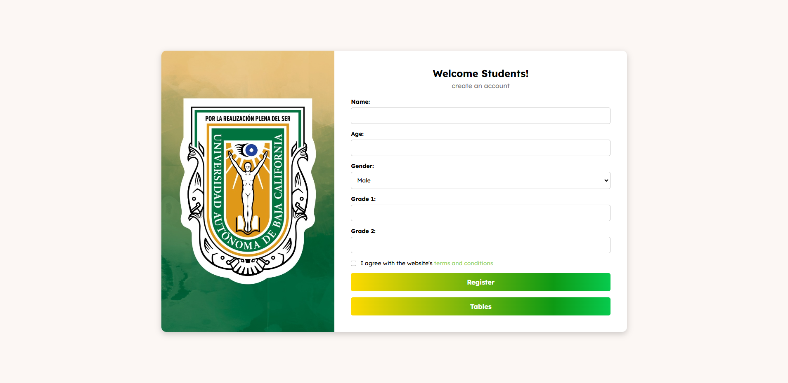
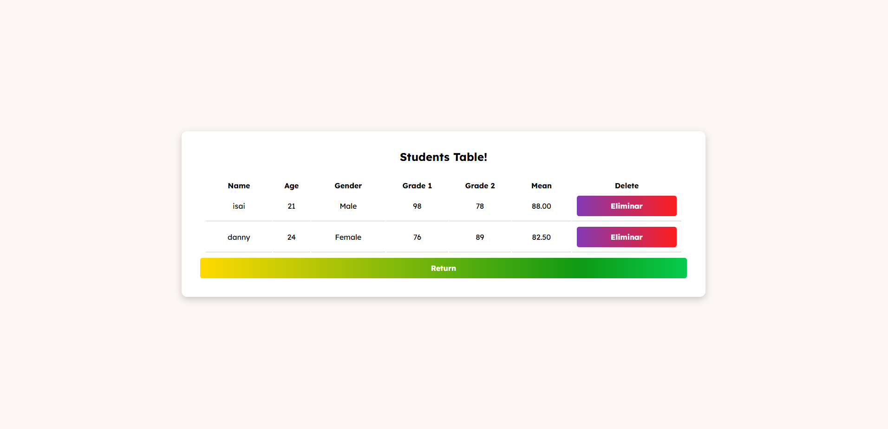
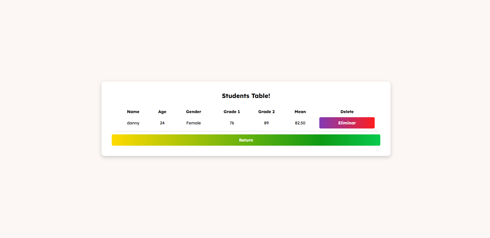

# Practice #6 - Student Registration and Data Storage with JavaScript

This is my sixth web development practice, where I created **two interactive pages** for student registration and data visualization. I implemented **Local Storage and data manipulation with JavaScript**. The project was part of an assignment to practice handling forms, storing data, and dynamically generating tables.

## What is this?

It is a simple student registration system consisting of two pages. The first allows students to enter their information into a form, and the second displays a table with the stored data. The data is saved in **Local Storage** in **JSON format** and can be manually deleted from the table. Key features include:

1. **Student Registration**: A form where users enter their name, age, gender, and grades.
2. **Local Storage**: The entered data is converted into objects and stored in the browser's local storage.
3. **Table Display**: A second page retrieves and displays the stored data in a dynamically generated table.
4. **Data Deletion**: Users can manually delete records from the table.
5. **Responsive Design**: The interface adapts to different devices for an optimal experience on any screen.

## Key Features

- **Registration Form**: Students enter their information, including name, age, gender, and grades.
- **Persistent Storage**: Data is saved in **Local Storage** as **JSON objects**, ensuring that information remains available even after reloading the page.
- **Table Visualization**: Stored data is retrieved and displayed in a table on a second page.
- **Record Deletion**: Each table row includes a button to manually delete student data.
- **Responsive Design**: The interface automatically adapts to different screen sizes for a better user experience.
- **Device Testing**: I used the **Responsive Viewer** Chrome extension to ensure the design works correctly on various devices.

## Screenshots

  
  
  

---

